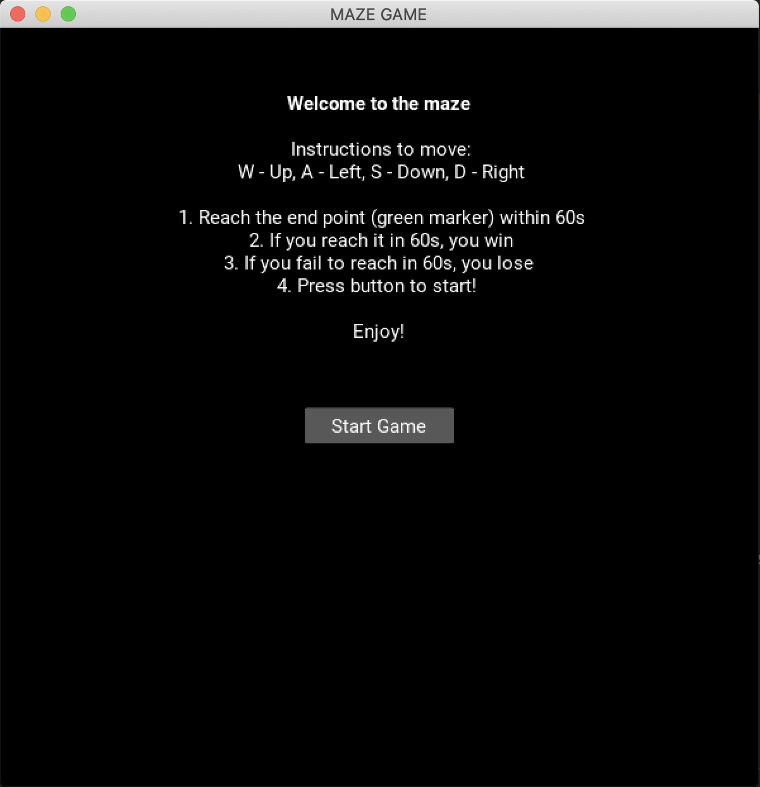
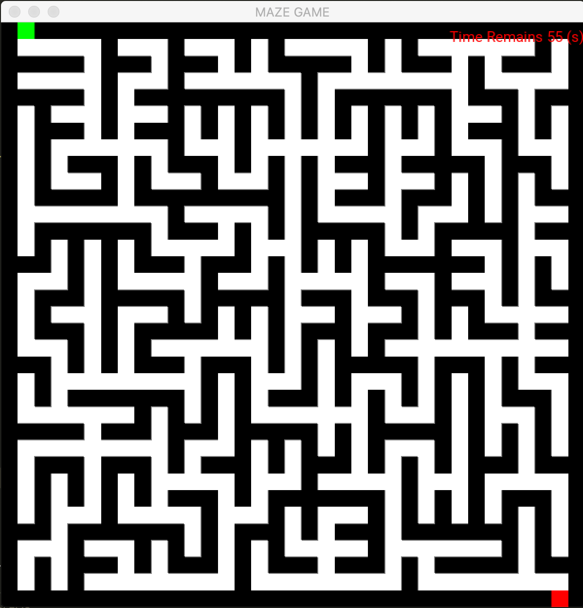
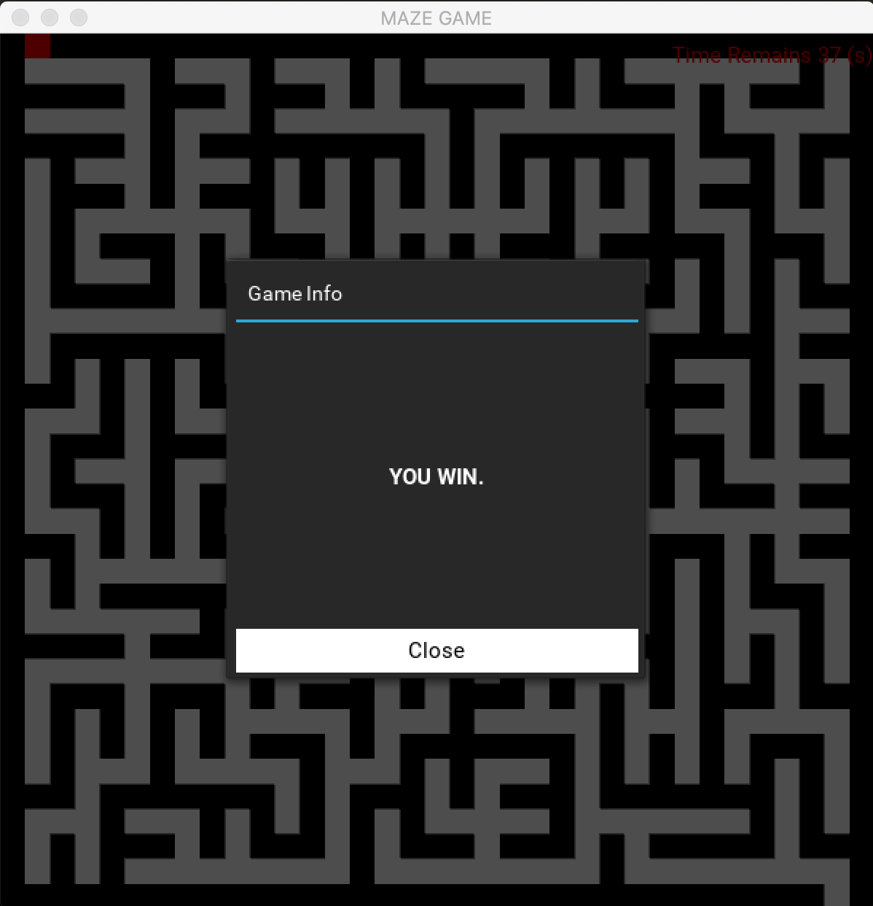

# Project Name
Maze Game by Amrish Dev Sandhu, 1004241, for Digital World Final Assignment 2020
Video URL Link: https://youtu.be/YdjL7YPwbD4

## Table of contents
* [Inspiration](#inspiration)
* [General info](#general-info)
* [Summary](#summary)
* [How to play the game](#how-to-play-the-game)
* [Screenshots](#screenshots)
* [Technologies](#technologies)
* [Concepts used from DW](#concepts-used-from-DW)
* [Setup](#setup)
* [Features](#features)
* [Design and thought process](#Design-and-thought-process)
* [Contact](#contact)

## Inspiration
Pacman, Jumanji board game (watched the movie when the assignment was released and got inspired slightly). I felt that a 2D maze game would also allow me to relive some of my childhood memories playing pokemon, running around on the map to reach certain points/objectives.

## General info
This game was designed for Digital World's Final Assignment. With the prior knowledge in hand learnt from the past cohorts, I thought about possible game concepts that would allow me to demonstrate what I have learnt. As such, after doing some research, I felt that collision and boundary setting were some necessary concepts within game creation that I was keen on learnign about.

Inside the mazegame.py you may find that I have written down comments to explain all the necessary lines of code so as to help you gain a better understanding. This was done with reference to the relevant documentation and my understanding of the functions by phrasing it in my own way of understanding. I hope that you enjoy the game! 

## Summary
A simple maze game, the white denotes the movable path and all black grids represent walls or borders. Controlling the Red Player using WASD keys, reach the green point under 60 seconds to win.

## How to play the game 
1. Instructions to move are as follows: W - Up, A - Left, S - Down, D - Right
2. Reach the end point (green marker) within 60s
3. If you reach it in 60s, you win.
4. If you fail to reach in 60s, you lose.
5. Press the button to start on the instructions screen and enjoy the game!

## Screenshots

## Technologies
* Kivy
* Anaconda
* Python 3
* VScode (choice of IDE))

## Concepts used from DW
* Kivy to come up with the UI 
* Nested Lists to create the grid for the maze
* If Else Statements for collision detection

## Setup
You would need to run the mazegame.py file from within the folder since it reads from maze.txt.

In line 62 of my code, the programme uses a relative path for the maze text file to be read. If you are using VSCODE or another IDE, and run into a directory error, you may have to use the following relative path instead: 
'Maze_Game_1004241_Final/maze.txt'
to replace the following 'maze.txt' and the game should run for you. 

## Features
1. Start Screen with instructions on the game, using gaming fundamental move mechanism of WASD. 
2. The maze game which has a countdown timer at the top right. The player is denoted by a red square, and the end point is denoted in green. 
3. if you reach the endpoint under 60 Seconds, a pop up will show you that you have won.

## Design and thought process
I used KIVY to come up with the game as it would was a new concept for me to develop some user interface planning and implementation skills. 

When planning this, I first planned out the 3 different screens I would need to come up with: the instruction screen, the game screen, and a result screen. 

To create the maze, I created a 2D array from a text file using an image I found online. The elements were as follows: x(wall), s(player), p(path to move) and W(winning position). Reading from this text file and returning a nested list of 35 lists with 35 elements each (the 2D array), I used KIVY to create buttons to represent each grid square accordingly by colors: black for a wall, white for path, red for player and green for the winning position.

The collision detection was integrated into the event handler binded to the key down event. WHen a key was pressed from WASD, the programme would check if the button in that direction was black and if not, update the surroundings to make it seem like the player was moving.  

## Contact
Created by Amrish Dev Sandhu, 19F06 under the guidance of Prof Oka.